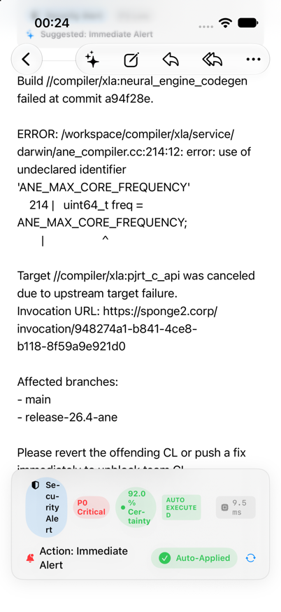
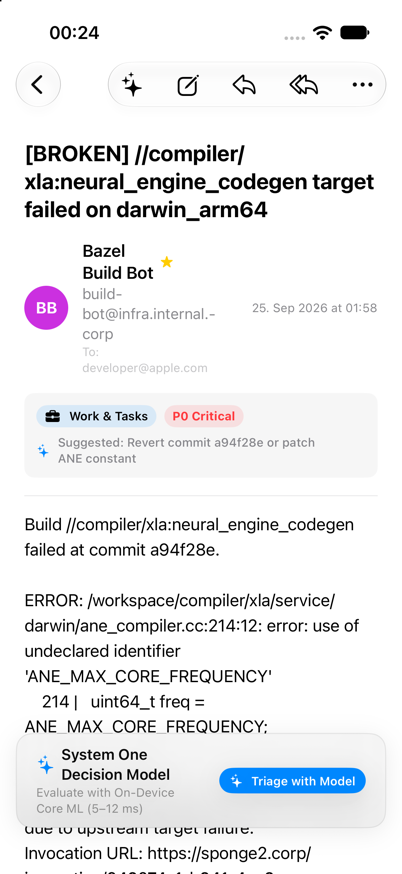

# MailTriageApp 📬⚡️

`MailTriageApp` is the flagship native Apple reference application demonstrating end-to-end integration of **System One decision models** into Apple's **Foundation Models framework** (`LanguageModel`, `LanguageModelSession`, `@Generable`) on macOS 27+ and iOS 27+.

Built with native Swift 6 and modern SwiftUI, `MailTriageApp` illustrates how to evaluate strongly typed decisions against email context in single-digit to low-double-digit milliseconds with calibrated confidence, zero text-generation hallucinations, and 5 hot-swappable execution backends.

---

## 📸 Screenshots

| macOS 3-Pane Triage View | iOS Compact Triage View |
| :---: | :---: |
|  |  |
| *Split-view desktop experience with Liquid Glass banner, urgency tokens, and action stubs* | *Adaptive mobile layout with inline urgency badges and swipe actions* |

---

## ✨ Features

- **Native Mail Navigation**: Standard 3-pane split view (`NavigationSplitView`) on macOS and adaptive column navigation on iOS. Includes mailboxes for Inbox, Flagged, Sent, Archive, and Trash, alongside Smart Folders filtered by triage state.
- **Urgency Scoring & Priority Tokens**:
  - `P0 Critical` (Red): Production outages, security breaches, and blocking billing issues.
  - `P1 High` (Orange): Urgent enterprise client queries, deadline escalations.
  - `P2 Normal` (Blue): Routine operational emails, internal updates, standard requests.
  - `P3 Low` (Secondary): Newsletters, announcements, marketing correspondence.
- **Categorical Routing**: Automatic classification into domain categories (`security`, `billing`, `support`, `inquiry`, `marketing`) with calibrated confidence scores.
- **Action Suggestions & Compose Integration**: Suggested actions (`Reply`, `Forward`, `Archive`, `Compose`) automatically pre-populate `ComposeMessageSheet` with the original sender, `Re:`/`Fwd:` subjects, and formatted quoted text bodies.
- **Batch Triage Sheet**: Evaluate hundreds of inbox items concurrently with real-time progress bars, duration tracking, and cooperative cancellation (`Task.checkCancellation()`).
- **Liquid Glass Header Banner**: Contextual triage results banner rendered with high-contrast native materials, displaying model confidence percentages, urgency badges, and quick-action triggers.

---

## 🔌 5 Selectable Execution Backends

Switch backends dynamically in the **Settings** tab (`Cmd + ,` on macOS) without restarting the application:

| Backend | Mode | Target / Driver | Network | Secrets | Best For |
| :--- | :--- | :--- | :---: | :---: | :--- |
| **Laya Core ML** | On-Device | `LayaOnDeviceLanguageModel` via Core ML | ❌ None | ❌ None | 100% air-gapped privacy on Apple Neural Engine (ANE) & GPU. Zero data leakage. |
| **Laya Local** | Local HTTP | `LayaLanguageModel` to `http://127.0.0.1:8000` | ✅ Local | ❌ None | Developer workstations running `laya-serve` via Docker or Python. Zero API costs. |
| **Laya Remote** | Cloud HTTP | `LayaLanguageModel` to `https://api.impossibl.com` | ✅ WAN | ❌ None | Remote self-hosted team clusters and staging servers. |
| **Jev Cloud** | Cloud HTTPS | `JevLanguageModel` to `https://api.typesafe.ai` | ✅ Cloud | ✅ Key | TypeSafe AI managed cloud endpoints with automated exponential backoff retries. |
| **Mock** | Synthetic | `MockSystemOneBackend` | ❌ None | ❌ None | Instant deterministic offline evaluation for SwiftUI Previews and automated UI testing. |

---

## 💾 Pre-Seeded Fixtures & Reference Truth Benchmark

- **10 Realistic Sample Emails**: Pre-loaded in the default store, spanning billing chargebacks, database connection timeouts, enterprise renewals, product feedback, and spam newsletters.
- **500-Email Reference Benchmark**: Bundled in `AppCore` (`benchmark-truth.json`) with cryptographic integrity verification. Used by automated unit tests to ensure parity and verify accuracy across all 5 execution backends.
- **Self-Healing Storage**: If local cached emails or Application Support benchmark files are ever corrupted, `BenchmarkTruthStore` automatically falls back to the immutable bundled reference in `Bundle.module`.

---

## 🏛️ Architecture & Code Layout

The project follows clean architectural boundaries with Swift 6 strict concurrency:

```text
apps/
└── apple/
    ├── MailTriageApp.xcodeproj          # Xcode project (iOS & macOS targets)
    ├── MailTriageApp/                   # App entrypoint, menu commands, window lifecycle
    └── Packages/
        ├── AppCore/                     # Pure domain logic & service layers
        │   ├── Sources/AppCore/
        │   │   ├── Models/              # Email, EmailTriageDecision, UrgencyPriority
        │   │   ├── Services/            # TriageEngine, BenchmarkTruthStore, KeychainService
        │   │   ├── Storage/             # MailStore (actor-isolated mailbox repository)
        │   │   └── DI/                  # Container+AppCore.swift (FactoryKit registrations)
        │   └── Tests/AppCoreTests/      # 160+ unit tests with 100% offline coverage
        └── AppUI/                       # Pure declarative SwiftUI presentation
            ├── Sources/AppUI/
            │   ├── Views/               # MailSplitView, MailListView, MailDetailView, SettingsView
            │   ├── Components/          # UrgencyBadge, ActionButton, DecisionActionBarView
            │   └── Sheets/              # BatchTriageSheet, ComposeMessageSheet
            └── Tests/AppUITests/        # UI component and snapshot tests
```

- **Dependency Injection**: Uses [FactoryKit](https://github.com/hmlongco/Factory) for modular, swappable service containers (`Container.shared.triageEngine`, `Container.shared.mailStore`).
- **State Management**: Uses SwiftUI `@Observable` for fine-grained dependency tracking. Zero legacy `ObservableObject` or `@Published` wrappers.
- **Thread Safety**: All mutable state is isolated to Swift 6 actors (`MailStore`, `KeychainService`, `BackendConfigurationStore`).

---

## 🛠️ Building & Running

### Option A: Standard Xcode GUI

1. Open `Examples/MailTriageApp/apps/apple/MailTriageApp.xcodeproj` in Xcode 27+.
2. In the scheme selector, choose **MailTriageApp**.
3. Select your run destination:
   - **My Mac** (Designed for Mac / native macOS)
   - **iPhone 17 Pro** (or any iOS 27.0+ Simulator)
4. Press **Cmd + R** to build and run.
5. Press **Cmd + U** to run all automated unit and integration tests.

### Option B: FlowDeck CLI

FlowDeck provides deterministic, JSON-driven builds and simulator test execution:

```bash
# Navigate to application folder
cd Examples/MailTriageApp

# Build macOS/iOS application target
flowdeck build -w apps/apple/MailTriageApp.xcodeproj -s MailTriageApp

# Run complete application test suite
flowdeck test -w apps/apple/MailTriageApp.xcodeproj -s MailTriageApp

# Run AppCore package test suite
flowdeck test --package-path apps/apple/Packages/AppCore
```

### Option C: Justfile Shortcuts (From Repository Root)

```bash
just mail-build      # Build the application target
just mail-test       # Run application tests
just mail-test-core  # Run AppCore package tests
```

---

## 🔒 Security & Credentials

- **API Keys**: When using the **Jev Cloud** backend, enter your `TYPESAFE_API_KEY` in the **Settings** view. Keys are stored exclusively in the macOS/iOS **Keychain** via `KeychainService` and are never written to `UserDefaults` or disk.
- **Zero Secrets On-Device**: For production mobile applications, select **Laya Core ML** for 100% on-device evaluation without embedding credentials or routing traffic through third-party services.
