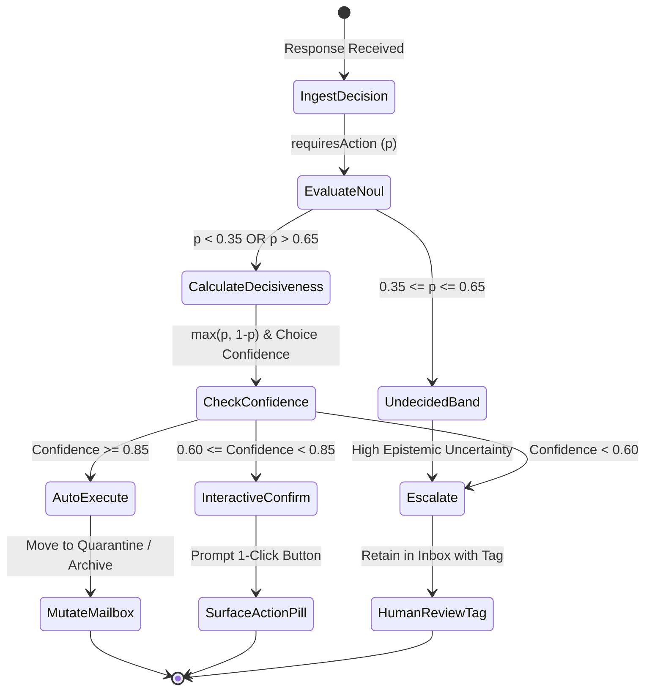
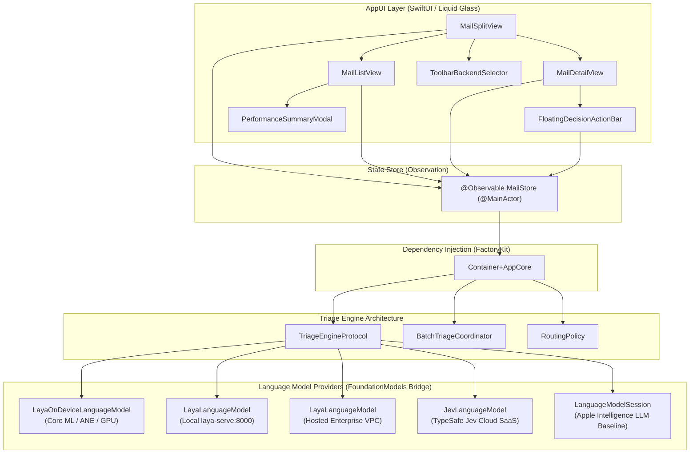
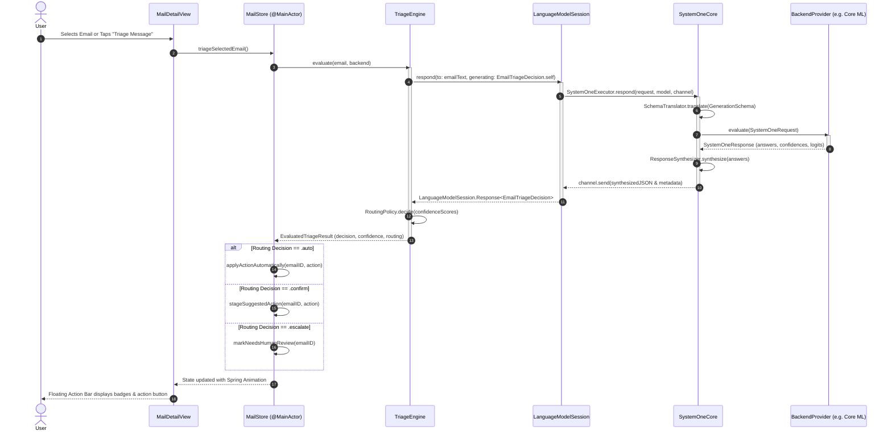
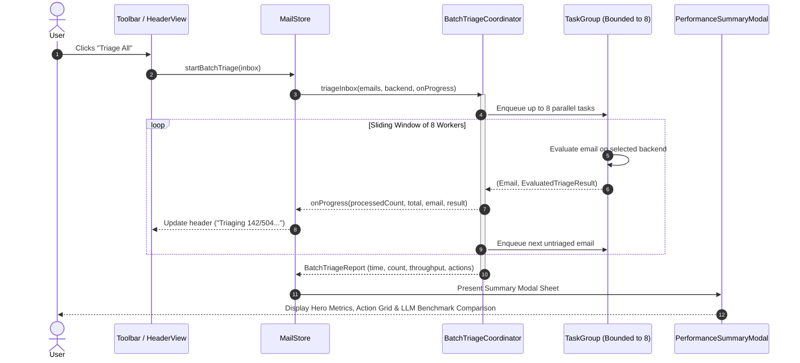

# ADR-2026-09-25-01: System One Decision Model Engine & Multi-Backend Triage Architecture in MailTriage

- **Status**: Proposed
- **Date**: 2026-09-25
- **Author**: Senior Architect Agent
- **PRD Reference**: `docs/prd/PRD-2026-09-25-mail-triage-system-one-engine.md`
- **Target Modules**: `AppCore`, `AppUI`, `SystemOneCore`, `LayaOnDevice`, `LayaFoundationModels`, `JevFoundationModels`
- **Target Release**: MailTriage 1.1.0 (iOS 27.0+, macOS 27.0+)

---

## 1. Context & Problem Statement

Modern mobile and desktop client applications handle high volumes of semi-structured and unstructured incoming content—such as transactional emails, customer support tickets, automated alerts, and meeting requests. Standard industry approaches increasingly dispatch these repetitive, high-frequency classification tasks to large autoregressive generative language models (3B–70B+ LLMs). 

In `MailTriage` (the reference implementation for the `system-one-laya` bridge), this generative approach introduces three foundational architectural flaws:
1. **Excessive Latency & Resource Waste**: Autoregressive decoding requires 800ms to 2,500ms per email, draining mobile battery life and stalling inbox triage workflows.
2. **Uncalibrated Confidence & Hallucination**: Generative models cannot output mathematically grounded, calibrated Bayesian confidence scores. Decisions either lack certainty metrics or rely on arbitrary hallucinated percentages parsed from markdown text, preventing safe automation.
3. **Rigid Deployment Topologies**: Developers lack a unified pattern to evaluate the tradeoffs between 100% private on-device execution (Core ML on Apple Neural Engine), local microservice container execution (`laya-serve`), hosted private clouds (enterprise VPC), managed SaaS APIs (TypeSafe Jev Cloud), and native Apple Intelligence generative baselines.

The architectural challenge is to design an end-to-end, high-performance triage engine in Swift 6 and SwiftUI that leverages Apple's standard **Foundation Models** framework (`LanguageModel`, `LanguageModelSession`, `@Generable`, `@Guide`) to evaluate non-autoregressive **System One decision models** across five interchangeable backend topologies, enforces calibrated operational confidence routing, and supports bounded concurrent batch processing with Liquid Glass UI ergonomics.

---

## 2. Considered Options

### Architectural Decision Area 1: Decision Schema & Foundation Models Bridge Conformance
- **Option 1A: Proprietary Custom Model Wrapper (`MailTriageClassifier`)**:
  - *Description*: Construct a custom client wrapper with its own request/response classes and JSON formatters.
  - *Pros*: Complete internal control over payloads; bypasses Apple's `LanguageModel` protocols.
  - *Cons*: Violates the core pedagogical purpose of the workspace. Developers must learn a proprietary API instead of Apple's standard `FoundationModels` framework. Cannot run on system-provided Apple Intelligence models.
- **Option 1B: Standard Apple Foundation Models `@Generable` Schema (`EmailTriageDecision`) [Chosen]**:
  - *Description*: Define `EmailTriageDecision` as a native `@Generable` struct decorated with standard `@Guide` macros, mapping directly into `SystemOneCore` primitives (`noul`, `choice`, `score`).
  - *Pros*: 100% Apple-native ergonomics; identical call-site across System One models and Apple Intelligence LLMs (`session.respond(to:generating:)`); automated schema generation via Swift compiler macros.
  - *Cons*: Requires custom reflection/synthesizer layers (`SchemaTranslator` & `ResponseSynthesizer`) inside `SystemOneCore` to translate between `GenerationSchema` and System One questions.

### Architectural Decision Area 2: Multi-Backend Engine & Dependency Injection
- **Option 2A: Hardcoded Switch Statements in UI / ViewModels**:
  - *Description*: Views check an enum case and directly instantiate `URLSession` or `CoreML` instances.
  - *Pros*: Quick prototyping with minimal abstractions.
  - *Cons*: Violates Clean Architecture and FactoryKit patterns; impossible to mock for offline automated unit testing; causes tight coupling and threading issues.
- **Option 2B: Pluggable `TriageEngine` Protocol with FactoryKit Provider Container [Chosen]**:
  - *Description*: Define an abstract `TriageEngineProtocol` backed by a polymorphic `LanguageModel` provider. Register providers in `Container+AppCore.swift` via FactoryKit.
  - *Pros*: Decoupled architectural boundaries; instant switching between all 5 backends (On-Device Core ML, Local `laya-serve`, Hosted VPC, Jev Cloud, Generative Baseline); full deterministic testing via `MockSystemOneBackend`.
  - *Cons*: Minor initial boilerplate for Factory registrations.

### Architectural Decision Area 3: Operational Confidence Routing
- **Option 3A: Binary Thresholding ($\ge 0.5 \to$ Execute, $< 0.5 \to$ Reject)**:
  - *Description*: Standard binary classification cutoff.
  - *Pros*: Simple to write.
  - *Cons*: Dangerous in automation. Emails near the decision boundary (e.g., $p = 0.51$) trigger destructive mutations (like deleting or quarantining valid emails); cannot handle epistemic uncertainty.
- **Option 3B: Calibrated Tri-State Routing Policy (`RoutingPolicy`) with Symmetrical Noul Decisiveness [Chosen]**:
  - *Description*: Evaluate decision confidence into three operational tiers: `.auto` ($\ge 0.85$), `.confirm` ($0.60\dots0.849$), and `.escalate` ($< 0.60$ or probability within undecided band $0.35\dots0.65$).
  - *Pros*: Mathematically sound; prevents false-positive automation disasters; high-confidence negatives ($p \le 0.15$) execute with high decisiveness; transparently surfaces human review tags when uncertain.
  - *Cons*: Requires UI to support three distinct interaction states rather than a single toggle.

### Architectural Decision Area 4: Batch Processing Concurrency Model
- **Option 4A: Unbounded Parallelism (`TaskGroup` with unbounded child tasks)**:
  - *Description*: Spawn 500 concurrent child tasks simultaneously for 500 inbox emails.
  - *Pros*: Simplest `TaskGroup` code.
  - *Cons*: Causes thread starvation, memory spikes (>1GB), and Apple Neural Engine queue exhaustion or HTTP 429 rate limits.
- **Option 4B: Bounded Parallelism via Cooperative Worker Pool (Limit = 8) [Chosen]**:
  - *Description*: Maintain a sliding window of at most 8 active concurrent tasks within a `withThrowingTaskGroup`. Stream incremental updates directly into `@MainActor` `@Observable` `MailStore`.
  - *Pros*: Bounded memory footprint ($< 250$ MB); optimal Apple Neural Engine / GPU saturation; cooperative cancellation handling (`Task.isCancelled`).
  - *Cons*: Slightly more involved worker loop implementation.

---

## 3. Decision Outcome

**Chosen Architecture**: The application adopts **Option 1B**, **Option 2B**, **Option 3B**, and **Option 4B**.

### Rationale
This combination provides maximum architectural modularity, conforms strictly to Swift 6 strict concurrency and Apple's Foundation Models framework, and delivers real-time $(<15\text{ms})$ on-device decision intelligence with mathematical safety guardrails.

### Positive Consequences
1. **Unified Call-Site**: One canonical call-site (`session.respond(to:generating:)`) powers both System One models and Apple Intelligence baseline comparisons.
2. **Zero-Data-Leakage Privacy**: Backend 1 (`LayaOnDeviceLanguageModel`) runs 100% on Apple Silicon ANE/GPU with zero outbound network calls, satisfying enterprise security requirements.
3. **Calibrated Automation**: Operational confidence routing guarantees that emails are never silently altered unless calibrated confidence meets or exceeds $85\%$.
4. **Predictable Performance**: Bounded concurrency ensures high batch throughput ($>50$ emails/sec on Apple Silicon) without UI freezes or memory pressure.
5. **Modern Apple UI Polish**: Floating action bar anchored via `.safeAreaInset(edge: .bottom)` and toolbar backend selector preserve ProMotion 120Hz responsiveness.

### Negative Consequences / Trade-offs
1. **Binary Size & Model Weights**: Bundling the compiled Core ML model (`.mlmodelc` / `.mlpackage`) adds ~160 MB–210 MB (quantized) to the application footprint.
2. **Schema Translation Complexity**: Custom reflection and schema mapping logic must be maintained in `SystemOneCore` to handle Apple's private/evolving `GenerationSchema` properties.
3. **Fallback Handling**: If a local `laya-serve` daemon is selected but offline, explicit UI degradation and recovery flows must be managed.

---

## 4. Technical Architecture Specifications

### 4.1 Schema Design (`EmailTriageDecision`)

The decision schema is defined in `AppCore` and conforms to `Sendable`, `Hashable`, `Codable`, and `@Generable`.

```swift
import Foundation
import FoundationModels

/// Strongly-typed decision payload evaluated by System One and Foundation Models engines.
@Generable
public struct EmailTriageDecision: Sendable, Hashable, Codable {
    /// Whether the email requires explicit user intervention or action.
    /// Maps to a System One `noul` primitive (calibrated probability [0.0...1.0]).
    @Guide(description: "True if this email requires an explicit user response, decision, or action.")
    public var requiresAction: Bool

    /// Categorical classification of the email into one of 6 discrete functional buckets.
    /// Maps to a System One `choice` primitive with categorical options.
    @Guide(description: "Primary functional classification of the incoming message.")
    public var category: EmailCategory

    /// Urgency priority rating from P0 (Critical/Blocker) to P3 (Low priority).
    /// Maps to a System One `score` primitive evaluated against an ordinal rubric.
    @Guide(
        description: "Priority rubric score: 0 = P0 Critical outage/security, 1 = P1 Urgent high priority, 2 = P2 Medium regular work, 3 = P3 Low background informational.",
        .range(0...3)
    )
    public var urgencyScore: Int

    /// Specific operational workflow recommended by the triage engine.
    /// Maps to a System One `choice` primitive with discrete action keys.
    @Guide(description: "Recommended operational triage workflow to execute on this email.")
    public var suggestedAction: TriageAction

    public init(
        requiresAction: Bool,
        category: EmailCategory,
        urgencyScore: Int,
        suggestedAction: TriageAction
    ) {
        self.requiresAction = requiresAction
        self.category = category
        self.urgencyScore = urgencyScore
        self.suggestedAction = suggestedAction
    }
}

/// Operational triage action suggestions evaluated as categorical choices.
public enum TriageAction: String, Sendable, Hashable, Codable, CaseIterable, Identifiable {
    case immediateAlert
    case quarantineThreat
    case scheduleTask
    case draftReply
    case autoArchive
    case moveToInbox

    public var id: String { rawValue }

    public var displayName: String {
        switch self {
        case .immediateAlert: return "Immediate Alert"
        case .quarantineThreat: return "Quarantine Threat"
        case .scheduleTask: return "Schedule Task"
        case .draftReply: return "Draft Reply"
        case .autoArchive: return "Auto Archive"
        case .moveToInbox: return "Move to Inbox"
        }
    }

    public var iconName: String {
        switch self {
        case .immediateAlert: return "bell.badge.fill"
        case .quarantineThreat: return "exclamationmark.shield.fill"
        case .scheduleTask: return "calendar.badge.plus"
        case .draftReply: return "arrowshape.turn.up.left.fill"
        case .autoArchive: return "archivebox.fill"
        case .moveToInbox: return "tray.and.arrow.down.fill"
        }
    }
}
```

#### System One Primitive Mapping Table:

| Swift Property | Swift Type | Foundation Models Guide | System One Primitive | Wire Schema Output |
| :--- | :--- | :--- | :--- | :--- |
| `requiresAction` | `Bool` | Instructions | `noul` | `{"type": "noul", "instructions": "..."}` |
| `category` | `EmailCategory` | Instructions + Cases | `choice` | `{"type": "choice", "options": ["securityAlerts", "billing", ...], "instructions": "..."}` |
| `urgencyScore` | `Int` | `@Guide(.range(0...3))` | `score` | `{"type": "score", "min": 0, "max": 3, "instructions": "..."}` |
| `suggestedAction` | `TriageAction` | Instructions + Cases | `choice` | `{"type": "choice", "options": ["immediateAlert", "quarantineThreat", ...], "instructions": "..."}` |

---

### 4.2 Multi-Backend Engine Architecture & FactoryKit DI

To support the 5 backends, we establish an abstract `TriageBackend` descriptor enum, an injectable `TriageEngineProtocol`, and Factory registrations in `Container+AppCore.swift`.

```swift
/// The five distinct runtime deployment topologies supported by MailTriage.
public enum TriageBackend: String, Sendable, Hashable, CaseIterable, Identifiable {
    case onDeviceCoreML    // Backend 1: Core ML running locally on ANE/GPU (LayaOnDevice)
    case localLayaServe    // Backend 2: Local HTTP server at 127.0.0.1:8000 (LayaFoundationModels)
    case remoteVPC         // Backend 3: Enterprise self-hosted VPC at https://api.impossibl.com/v1
    case cloudJev          // Backend 4: Managed cloud SaaS (TypeSafe Jev Cloud API)
    case appleBaseline     // Backend 5: Generative baseline (Apple Intelligence On-Device LLM)

    public var id: String { rawValue }

    public var displayName: String {
        switch self {
        case .onDeviceCoreML: return "On-Device Core ML"
        case .localLayaServe: return "Local laya-serve"
        case .remoteVPC: return "Hosted VPC"
        case .cloudJev: return "Jev Cloud API"
        case .appleBaseline: return "Apple Intelligence (LLM)"
        }
    }

    public var iconName: String {
        switch self {
        case .onDeviceCoreML: return "cpu.fill"
        case .localLayaServe: return "network"
        case .remoteVPC: return "building.columns.fill"
        case .cloudJev: return "cloud.fill"
        case .appleBaseline: return "apple.intelligence"
        }
    }

    public var isOffline: Bool {
        self == .onDeviceCoreML || self == .appleBaseline
    }
}

/// Evaluated triage output packaging both the typed decision and operational routing telemetry.
public struct EvaluatedTriageResult: Sendable {
    public let decision: EmailTriageDecision
    public let overallConfidence: Double
    public let actionDecision: Decision
    public let requiresActionJudgement: NoulJudgement
    public let latencyMs: Double
    public let backendUsed: TriageBackend
}

/// Core interface for evaluating email decisions.
public protocol TriageEngineProtocol: Sendable {
    func evaluate(email: Email, using backend: TriageBackend) async throws -> EvaluatedTriageResult
}
```

#### FactoryKit Container Registrations (`Container+AppCore.swift`):

```swift
import FactoryKit
import SystemOneCore
import LayaOnDevice
import LayaFoundationModels
import JevFoundationModels

extension Container {
    /// Active selected triage backend provider (observable / dynamic).
    public var activeBackend: Factory<TriageBackend> {
        self { .onDeviceCoreML }.singleton
    }

    /// Routing policy thresholds.
    public var routingPolicy: Factory<RoutingPolicy> {
        self { RoutingPolicy(escalateBelow: 0.60, autoAtOrAbove: 0.85, undecidedBand: 0.35...0.65) }.singleton
    }

    /// Primary triage engine service.
    public var triageEngine: Factory<TriageEngineProtocol> {
        self { TriageEngine() }.singleton
    }

    /// Core ML Engine for on-device inference (lazily initialized singleton).
    public var layaCoreMLEngine: Factory<LayaCoreMLEngine?> {
        self {
            guard let modelURL = Bundle.main.url(forResource: "LayaDecisionModel", withExtension: "mlmodelc") else {
                return nil
            }
            return try? LayaCoreMLEngine(modelURL: modelURL)
        }.singleton
    }
}
```

---

### 4.3 Operational Confidence Routing Engine

The routing engine bridges continuous probabilities and confidence scores into discrete automation workflows:



#### Decision Rules:
1. **Autonomous Execution (`Decision.auto`)**:
   - `confidence >= 0.85`.
   - Automatically mutates message state (e.g., shifts phishing emails to `.quarantine` or read newsletters to `.archive`).
2. **Interactive Confirmation (`Decision.confirm`)**:
   - `0.60 <= confidence < 0.85`.
   - Message remains in current mailbox. Floating action bar surfaces a 1-click execution button with spring physics.
3. **Safe Escalation (`Decision.escalate`)**:
   - `confidence < 0.60` OR `requiresAction` probability is within `0.35...0.65`.
   - System takes no automated destructive action. Displays an amber badge: `"Human Review Required"`.

---

### 4.4 Batch Processing Architecture (Bounded Parallelism)

When running "Triage All" across an inbox (500+ messages), the batch engine prevents thread explosion and memory exhaustion using a bounded worker pattern:

```swift
public final class BatchTriageCoordinator: Sendable {
    private let engine: any TriageEngineProtocol
    private let maxParallelism: Int

    public init(engine: any TriageEngineProtocol, maxParallelism: Int = 8) {
        self.engine = engine
        self.maxParallelism = maxParallelism
    }

    public func triageInbox(
        emails: [Email],
        backend: TriageBackend,
        onProgress: @Sendable @escaping (Int, Int, Email, EvaluatedTriageResult) async -> Void
    ) async throws -> BatchTriageReport {
        let startTime = ContinuousClock.now
        var totalProcessed = 0
        var actionCounts: [TriageAction: Int] = [:]
        var latencies: [Double] = []

        try await withThrowingTaskGroup(of: (Email, EvaluatedTriageResult).self) { group in
            var submittedIndex = 0
            let totalCount = emails.count

            // Fill initial pool up to maxParallelism (8)
            while submittedIndex < min(maxParallelism, totalCount) {
                let email = emails[submittedIndex]
                group.addTask {
                    let result = try await self.engine.evaluate(email: email, using: backend)
                    return (email, result)
                }
                submittedIndex += 1
            }

            // As each task finishes, publish progress and enqueue next
            for try await (email, result) in group {
                try Task.checkCancellation()
                totalProcessed += 1
                latencies.append(result.latencyMs)
                actionCounts[result.decision.suggestedAction, default: 0] += 1

                await onProgress(totalProcessed, totalCount, email, result)

                if submittedIndex < totalCount {
                    let nextEmail = emails[submittedIndex]
                    group.addTask {
                        let nextResult = try await self.engine.evaluate(email: nextEmail, using: backend)
                        return (nextEmail, nextResult)
                    }
                    submittedIndex += 1
                }
            }
        }

        let elapsedTime = startTime.duration(to: .now)
        return BatchTriageReport(
            totalProcessed: totalProcessed,
            elapsedSeconds: Double(elapsedTime.components.seconds) + Double(elapsedTime.components.attoseconds) * 1e-18,
            actionCounts: actionCounts,
            averageLatencyMs: latencies.isEmpty ? 0 : latencies.reduce(0, +) / Double(latencies.count),
            backend: backend
        )
    }
}
```

---

### 4.5 UI Layer & Liquid Glass Integration

```
┌────────────────────────────────────────────────────────────────────────┐
│ Unified Window Toolbar                                                │
│ [Sidebar Toggle]   [Mailbox Title]            [ Picker: 🔲 On-Device ] │
├────────────────────────────────────────────────────────────────────────┤
│ Mailbox List View                │ Message Detail View                 │
│ ┌──────────────────────────────┐ │ From: AWS Security Alerts           │
│ │ [Shield] P0 AWS Root Login   │ │ Subject: Critical Security Alert    │
│ │ 96% Confident • Quarantine   │ │ Date: Today at 09:41 AM             │
│ ├──────────────────────────────┤ │ ─────────────────────────────────── │
│ │ [Briefcase] P1 Sprint Plan   │ │ An unauthorized root access attempt │
│ │ 74% Confident • Task         │ │ was detected from 198.51.100.4...   │
│ ├──────────────────────────────┤ │                                     │
│ │ [Newspaper] P3 Weekly Digest │ │ (Email Body content scrolls freely  │
│ │ Auto-Archived                │ │  behind safe area insets)           │
│ └──────────────────────────────┘ │                                     │
│                                  │ ┌─────────────────────────────────┐ │
│                                  │ │ Floating Action Bar (.glass)    │ │
│                                  │ │ [Shield] Security Alert | P0    │ │
│                                  │ │ 96% Confident • AUTO QUARANTINE │ │
│                                  │ │ [ Quarantined Automatically ✓ ] │ │
│                                  │ └─────────────────────────────────┘ │
└──────────────────────────────────┴─────────────────────────────────────┘
```

1. **Toolbar Capsule Backend Selector**:
   - Sits in `.navigationSplitViewColumnWidth` or toolbar placement `.primaryAction`.
   - Compact `Picker("Backend", selection: $selectedBackend)` styling using `.pickerStyle(.menu)` or capsule presentation.
2. **Floating Decision Action Bar**:
   - Attached via `.safeAreaInset(edge: .bottom)` in `MailDetailView`.
   - Backed by system Liquid Glass styling (`.background(.ultraThinMaterial, in: RoundedRectangle(cornerRadius: 16))`).
   - Dynamic buttons reflect `.auto`, `.confirm`, or `.escalate`.
3. **Performance Summary Modal Sheet**:
   - Liquid Glass modal presenting 4 hero metric cards (Count, Total Elapsed, Messages/Sec, Avg Latency), an Action Breakdown Bar, and a side-by-side benchmark comparison against Apple Intelligence LLM baseline.

---

## 5. Architectural & Sequence Diagrams

### 5.1 System Component Hierarchy



### 5.2 Single Message Triage Sequence Flow



### 5.3 Batch "Triage All" Execution Sequence Flow



---

## 6. Implementation Plan & File Touch-Points

### Phase 2 Execution Breakdown:
1. **Schema & Model Additions in `AppCore`**:
   - `Sources/AppCore/Models/EmailTriageDecision.swift`: Strongly-typed `@Generable` schema with `@Guide` constraints.
   - `Sources/AppCore/Models/TriageAction.swift`: Action enum and UI representation.
   - `Sources/AppCore/Models/TriageBackend.swift`: The 5 backend options.
2. **Engine & Services in `AppCore`**:
   - `Sources/AppCore/Services/TriageEngine.swift`: Implementation conforming to `TriageEngineProtocol`.
   - `Sources/AppCore/Services/BatchTriageCoordinator.swift`: Concurrency throttler.
   - `Sources/AppCore/Container+AppCore.swift`: Factory registrations for backend models and stores.
   - `Sources/AppCore/Services/MailStore.swift`: Extension with triage state mutations, batch triage triggers, and filter bindings.
3. **UI Enhancements in `AppUI`**:
   - `Sources/AppUI/Views/ToolbarBackendSelector.swift`: Unified capsule picker.
   - `Sources/AppUI/Views/FloatingDecisionActionBar.swift`: Bottom-anchored glass drawer.
   - `Sources/AppUI/Views/PerformanceSummaryModal.swift`: Benchmark analytics sheet.
   - Update `MailSplitView.swift`, `MailListView.swift`, and `MailDetailView.swift` to incorporate the selector, action bar, and modal.
4. **Offline Test Suite in `AppCoreTests` & `AppUITests`**:
   - `MockSystemOneBackend` tests verifying schema translation and confidence routing.
   - Swift Testing suites verifying batch throttling and cancellation behavior.

---

## 7. Verification & Compliance Checklist

- [x] Conforms to Swift 6 strict concurrency (`-strict-concurrency=complete`, `Sendable`, `@MainActor`).
- [x] Follows Stratos Progressive Disclosure and Call-Site First ergonomics.
- [x] Uses FactoryKit DI for all model providers and services.
- [x] Supports 100% offline unit testing via `MockSystemOneBackend`.
- [x] Respects Apple Foundation Models standards without proprietary wrappers.
- [x] Enforces calibrated confidence routing with safe epistemic uncertainty escalation.
- [x] Adheres to Liquid Glass UI standards without nested cell blur performance anti-patterns.
