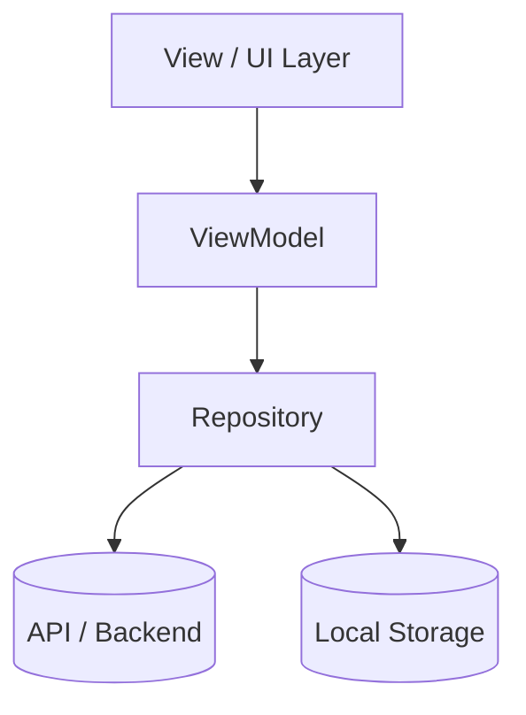

# ADR-{{ADR_NUMBER}}: {{TITLE}}

- **Status**: Proposed | Accepted | Deprecated | Superseded
- **Date**: {{DATE}}
- **Author**: Senior Architect Agent

---

## Context & Problem Statement
What technical problem or architectural decision are we addressing?

## Considered Options
1. **Option A**: Description, pros, and cons.
2. **Option B**: Description, pros, and cons.

## Decision Outcome
Chosen Option: **Option A** because [rationale].

### Positive Consequences
- Benefit 1
- Benefit 2

### Negative Consequences / Trade-offs
- Trade-off 1

## Architecture & Data Flow Diagram

